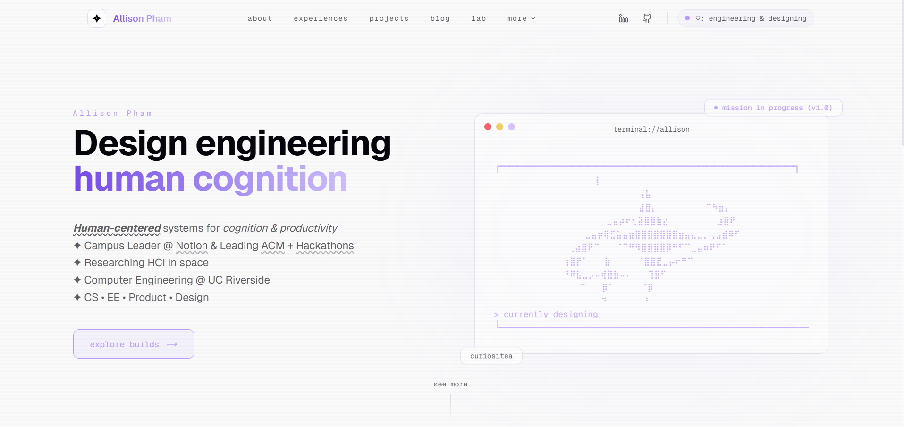

# allisonpham.dev (Personal Portfolio Website)

    <strong>allisonpham.dev (Personal Portfolio Website)</strong> showcases experiences, projects, experiments, tinkering, etc.

    

    💌 <a href="https://allisonpham.dev">allisonpham.dev</a>

## Features
| **Overview** | **Details** |
|---|---|
| About | |
| Experiences | |
| Projects | |
| Blog | |
| Lab | |
| Collections | |
| Playground | |

## Getting Started
| **Step** | **Instructions** |
|---|---|
| Git + GitHub Setup | • Ensure Git is installed ([download](https://git-scm.com/install/windows) based on OS) • Clone this GitHub repository using an IDE (e.g. Visual Studio Code) &nbsp;&nbsp;&nbsp;&nbsp;• Click "Code" (green button) > HTTPS > copy the link • Run `git clone "https://github.com/allison-pham/allisonpham.dev"` |
| Installation | • Run `npm install` |
| Frontend | • Open up terminal: `npm run dev` • Open http://localhost:3000 |
